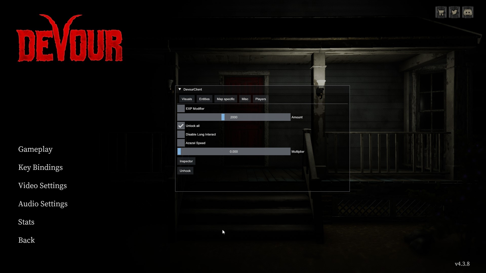

# DevourClient

Devour client is a cheat for the game DEVOUR. It is written in C++.

## Detection rate

Not detected.

## Menu

## Features

* Fully compatible with the new IL2CPP version of the game
* Detects if you're in game, so no chances of crashing on main menu by activating features
* Detects the map you are playing on (useful for the instant win)
* Unlimited UV light
* Fullbright (allows your flashlight to light a lot more)
* Player ESP
* Player Snaplines
* Spawn any item
* Force Star The Game
* Instant Win
* TP to Azazel
* Fly
* EXP Modifier
* Unlock all, including flashlights, perks, outfits. Active by default, can't be turned off, no persistance.
* Disable long interact
* Azazel Speed
* Change Player Speed
* Revive yourself/everyone
* Send Jumpscare To Players
* Kill yourself/everyone

# How To Install

[https://www.youtube.com/watch?v=uBwTqp5B4gU](https://www.youtube.com/watch?v=uBwTqp5B4gU)

## Building from source

0. Clone the repository (or Code -> Download Zip)
1. Open the DevourClient.sln file in Visual Studio 2022
2. Go at the top of the window, change Debug to Release and set the architecture to x64
3. Go to Build --> Build solution

## Contact

You can add me on discord at "_.patate"

## Code used

Library used to hack IL2CPP from C++ at runtime :
* [Il2CppInspector](https://github.com/djkaty/Il2CppInspector)

For teaching me the basics :
* [A Begginner's Guide To Hacking Unity Games](https://www.unknowncheats.me/wiki/A_Beginner%27s_Guide_To_Hacking_Unity_Games)

For teaching me about the UnityEngine API :
* [Unity User Manual 2020.3 (LTS)](https://docs.unity3d.com/Manual/index.html)

For decompiling and looking in the source code of the game :
* [dnSpy : a .NET debugger and assembly editor](https://github.com/dnSpy/dnSpy)

Game's last update before il2cpp :
* https://steamdb.info/depot/1274571/history/?changeid=M:1960656865974212833

## Contributing

Open an [issue](https://github.com/ALittlePatate/DevourClient/issues/new) or make a [pull request](https://github.com/ALittlePatate/DevourClient/pulls), i'll be glad to improve my project with you !

## License

[GPL 3.0](https://www.gnu.org/licenses/gpl-3.0.md)
